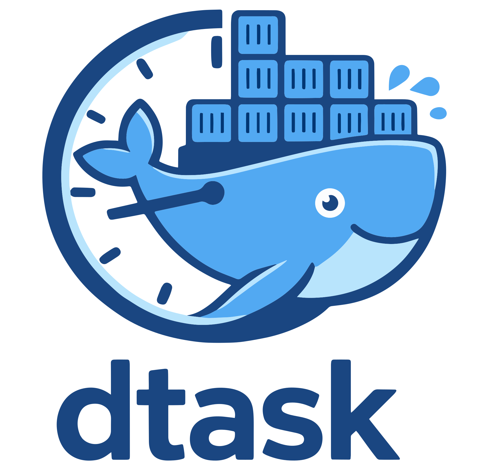

# dtask

Lightweight Docker task runner for Docker Compose stacks.

<p align="center">
  
</p>

- Docs: <https://kristianvld.github.io/dtask/>
- Repo: <https://github.com/kristianvld/dtask>
- Image: `ghcr.io/kristianvld/dtask`

## What It Does

`dtask` reads task configuration from container environment variables and schedules commands in one of three modes:

- `container`: run inside the dtask container
- `host`: run on host via chroot (`/host`)
- `compose`: run on host via chroot with cwd at compose stack directory

Each task uses `<task>.schedule` and `<task>.cmd` keys. Global defaults can be set with `<key>` and overridden per task with `<task>.<key>`.

## Quick Start

```yaml
services:
  dtask:
    image: ghcr.io/kristianvld/dtask
    restart: unless-stopped
    volumes:
      - /:/host
    environment:
      run: compose
      update.schedule: 02:00-04:00
      update.cmd: docker compose up -d --build --pull
```

## Validation and Runtime Rules

`dtask` fails fast on invalid configuration:

- unknown environment keys are rejected (except allowlist: `PATH,HOSTNAME,HOME,PWD,TERM,SHLVL,_`)
- task names must match `^[a-z0-9_]+$`
- each task must define both `<task>.schedule` and `<task>.cmd`
- invalid enums, durations, backoff values, timezones, or schedule strings fail startup
- `run=host` / `run=compose` require root and `/:/host` mount
- `run=compose` resolves stack directory from Docker label `com.docker.compose.project.working_dir`

Scheduler semantics:

- no overlap: if a task is still running, the next tick is skipped
- no catch-up: restarts do not backfill missed runs

## Notifications (Apprise)

Notifications are configured with `notify`, `notify_url`, `notify_attach_log`, `notify_retry`, and `notify_backoff`.

- `notify_url` must be a valid Apprise URL
- dtask sends through `apprise` Python CLI
- if `notify_attach_log` is `fail` or `always`, provider attachment support is validated at startup

## Local Development

Requirements:

- Go 1.26+
- Bun (for docs)

Commands:

```bash
make test
make lint
make build
```

Docs:

```bash
cd docs
bun install --frozen-lockfile
bun run build
```

## Container Image

`Dockerfile` is multi-stage and produces a minimal Alpine runtime image with:

- `dtask` binary
- `bash`
- BusyBox core tools (e.g. `tar`)
- `tzdata`
- `ca-certificates`
- Python `apprise` notification CLI

## Versioning and Releases

Releases are semver tag driven (`vX.Y.Z`) through GitHub Actions:

- publish multi-arch image to GHCR (`linux/amd64`, `linux/arm64`)
- image tags: `latest`, `X`, `X.Y`, `X.Y.Z`
- create GitHub release notes
